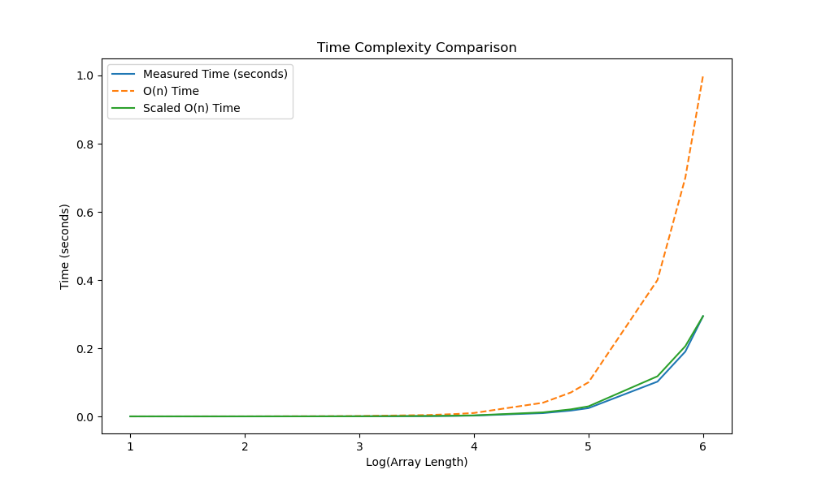
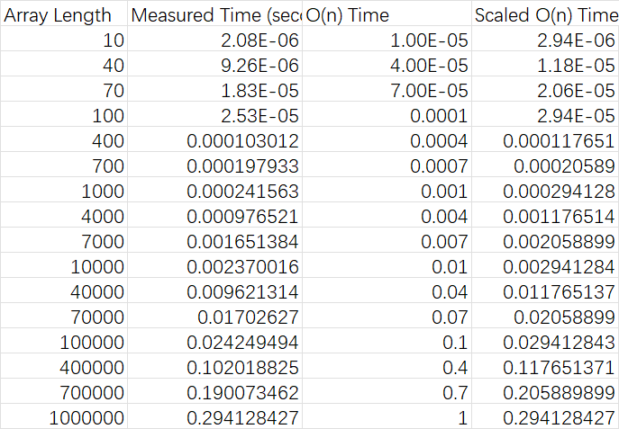

# CSCI_6212_Algorithm_project2
CSCI 6212 project 2

- Run quick_select.py to have a basic test on code
- And you can run main.py to have further test on code
- Using time_test.py to calculate the time cost in different array size 10^n (Defualt set n = 1 ~ 6)
- The result(csv and figure) will be storaged in ./record/current_time/

Result of time_test.py:

And the data is:

Get csv here:
[CSV](data.csv)